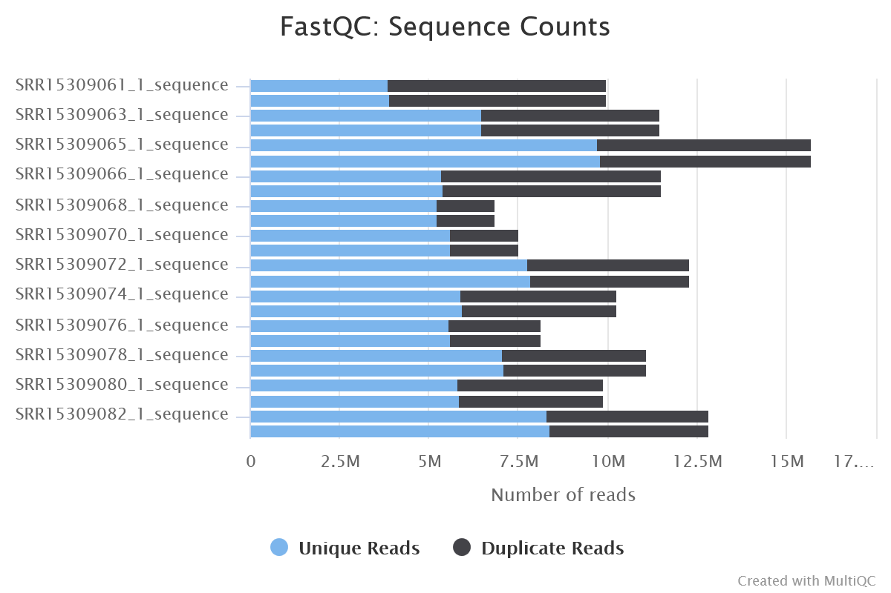
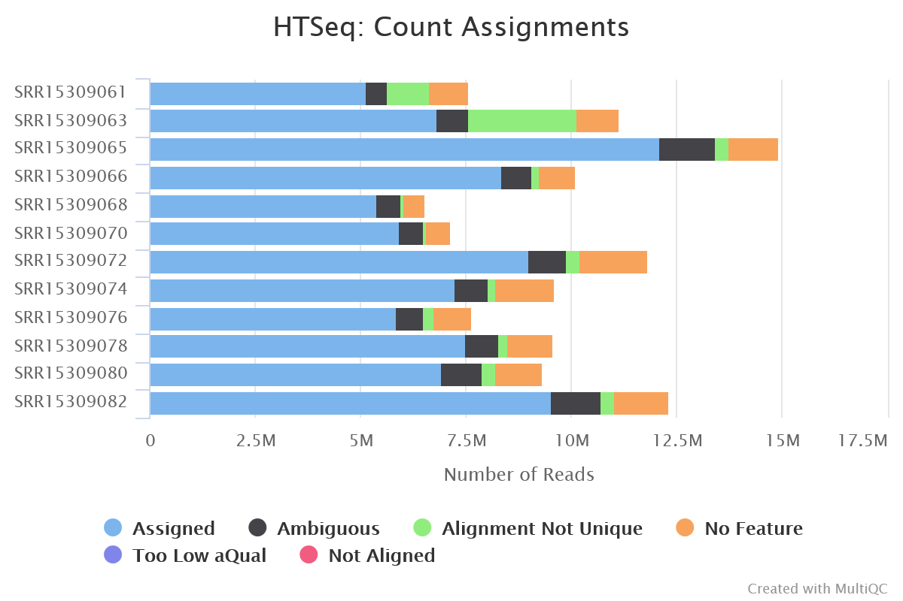
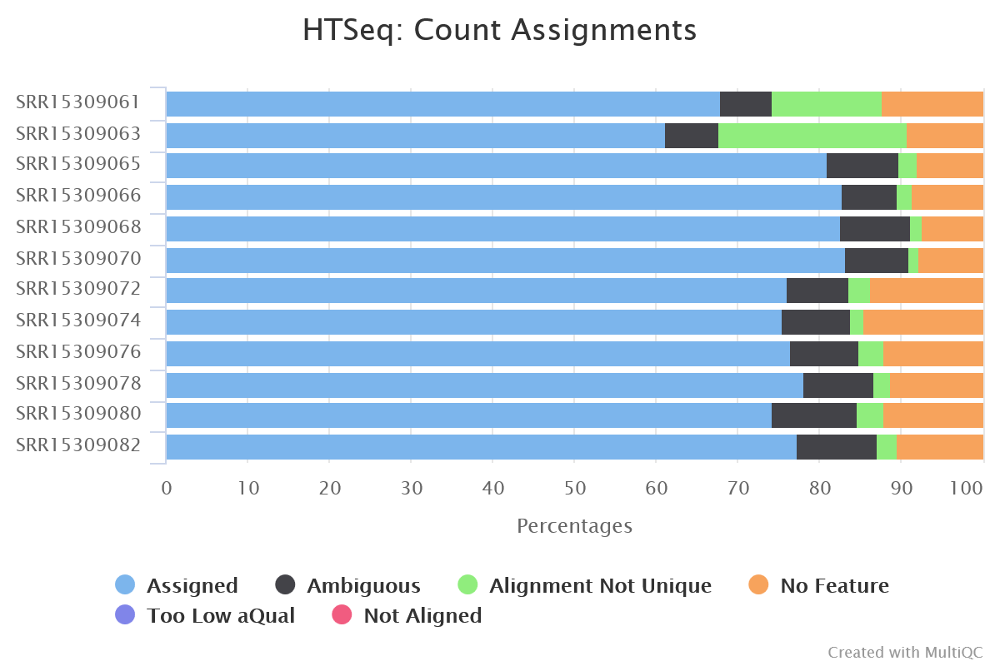
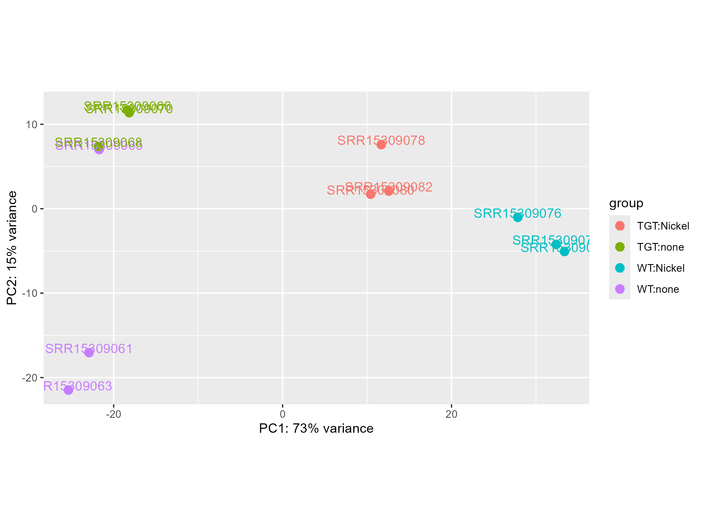
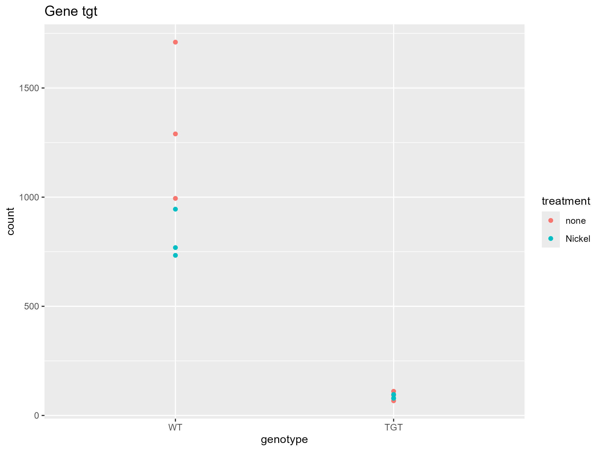

```{r setup, include=FALSE}
knitr::opts_chunk$set(
  echo = TRUE,
  warning = FALSE,
  message = FALSE,
  fig.align = "center",
  fig.pos = "H"
)

knitr::write_bib(c("DESeq2", "ggplot2", "tidyverse",
                   "knitr", "rmarkdown"), file = 'packages.bib')
```

# Introduction

[Add introduction text here]

# Raw Reads and Mapping Quality Control

## FastQC Analysis

### a) Sequencing Depth per Sample

```{r, echo=FALSE, out.width="85%", fig.cap="Barplot of the number of read pairs per sample as reported by FastQC."}

```

According to FastQC (Figure 1), the minimum number of read pairs per sample is approximately 6.8 million, while the maximum is approximately 15.7 million.

### b) Most Overrepresented Sequence

According to the MultiQC report, the most overrepresented sequence detected by FastQC was:

```
AAAAAAAAAAAAAAAAAAAAAAAAAAAAAAAAAAAAAAAAAAAAAAAAAAAA
```

### c) Potential Source of Homopolymer Sequences

This homopolymer sequence likely originates from **A-tailed adapter dimers** and **PCR slippage products** that outcompete genuine RNA fragments in the library construction process.

## HTSeq-count Assignment

### d) Read Pair Counts per Sample

```{r, echo=FALSE, out.width="85%", fig.cap="Barplot of the number of read pairs per sample as reported by HTSeq-count."}

```

According to HTSeq-count (Figure 2), the minimum number of read pairs per sample is approximately 5.9 million, while the maximum is approximately 14.8 million.

### e) Percentage of Uniquely Assigned Reads

```{r, echo=FALSE, out.width="85%", fig.cap="HTSeq assignment plot showing percentage of reads uniquely assigned to genes."}

```

As shown in Figure 3, the minimum percentage of reads uniquely assigned to genes is 61.3%, while the maximum is approximately 83.3%.

\newpage

# Dataset Description

## Sample Information

### a) Strain and Genotype Identification

The **genotype** column defines the base strain (wild type vs. TGT mutant), while the **strain** column indicates the *E. coli* strain used.

**Identified error:** The strain column appears to suggest a different strain for each experiment. However, the methods section of the paper specifies that only "Escherichia coli K-12 MG1655" was used as the WT strain.

### b) Nickel Treatment Column

The **treatment** column defines whether nickel was added to the media.

### c) SRA Study Information

The following metadata was retrieved from the SRA Study page:

- **Sequencing platform:** Illumina HiSeq 2500
- **Library layout:** PAIRED
- **Data release date:** 2022-05-16

## Raw Count Data

# Data Preprocessing

## Filtering Analysis

### a) Original Gene Count

```{r, eval=FALSE}
dim(rawCounts)
#[1] 4295   12
```

Originally, count data were retrieved for **4,295 genes**.

### b) Gene Count After Filtering

```{r, eval=FALSE}
dim(rawCounts[rowSums(rawCounts) > 10, ])
#[1] 4221   12
```

After applying the filter (rowSums > 10), **4,221 genes** remain.

\newpage

# Differential Gene Expression (DGE) Analysis

## Extracting and Interpreting Results

### a) Differentially Expressed Genes: WT Nickel vs. WT No Treatment

```{r, eval=FALSE}
DESeq2Results_WT_nickel <- results(
  DESeq2Data, 
  contrast = c("group", "WT.Nickel", "WT.none")
)

summary(DESeq2Results_WT_nickel)
```

In the nickel-treated WT strain compared to untreated WT strain (at p-value < 0.1), **1,069 genes are significantly up-regulated** and **1,063 genes are significantly down-regulated**.

### b) Default Significance Cutoff

The standard cutoff for adjusted p-value is **α = 0.1 (10%)**.

### c) Total Significantly Differentially Expressed Genes: TGT Nickel vs. TGT No Treatment

```{r, eval=FALSE}
DESeq2Results_TGT_nickel <- results(
  DESeq2Data, 
  contrast = c("group", "TGT.Nickel", "TGT.none"),
  alpha = 0.1
)

summary(DESeq2Results_TGT_nickel)
```

The total number of significantly differentially expressed genes is **1,863** (986 up-regulated + 877 down-regulated).

## Effect of Significance Level

### d) Genotype Comparison at α = 0.05

```{r, eval=FALSE}
DESeq2Results_genotype <- results(
  DESeq2Data, 
  contrast = c("group", "TGT.none", "WT.none"),
  alpha = 0.05
)

summary(DESeq2Results_genotype)
```

At a significance level of α = 0.05, there are **462 significantly differentially expressed genes** (187 up-regulated + 275 down-regulated) when comparing TGT mutant to WT under standard conditions.

### e) TGT Mutant Nickel Treatment Effect at α = 0.05

```{r, eval=FALSE}
DESeq2Results_TGT_nickel <- results(
  DESeq2Data, 
  contrast = c("group", "TGT.Nickel", "TGT.none"),
  alpha = 0.05
)

summary(DESeq2Results_TGT_nickel)
```

At a significance level of α = 0.05, there are **1,578 significantly differentially expressed genes** (826 up-regulated + 752 down-regulated) in the TGT mutant strain when comparing nickel-treated to untreated conditions.

\newpage

# Data Visualization and Quality Control

## Experimental Quality Control: Sample Clustering (PCA)

```{r, echo=FALSE, out.width="85%", fig.cap="Principal Component Analysis (PCA) plot showing clustering of samples."}

```

### a) Replicate Group Behavior

The samples cluster as expected. Individual experimental groups are clearly separated from each other. Notably, there is substantial separation between untreated and nickel-treated samples for both WT and TGT strains, which is consistent with the strong transcriptomic response to nickel treatment.

### b) Outlier Identification

The WT untreated (WT.none) samples do not cluster perfectly together. Specifically, one WT.none replicate clusters closer to the TGT.none group, suggesting it may be an outlier and warrants further investigation.

## Single Gene Expression: tgt Gene Counts

```{r, echo=FALSE, out.width="85%", fig.cap="Expression counts for the tgt gene across all experimental conditions."}

```

### c) Expected tgt Gene Expression Patterns

The observed read count patterns for the tgt gene align with functional expectations:

**WT + No Nickel:** Expected to show **high counts**. The tgt gene encodes tRNA guanine transglycosylase, an essential enzyme for queuosine synthesis, and is constitutively expressed during normal growth.

**WT + Nickel:** Expected to show **lower counts than WT + No Nickel**. Nickel stress causes transcriptional repression of the tgt gene, resulting in reduced expression relative to untreated conditions.

**TGT Mutant + No Nickel:** Expected to show **very low to near-zero counts**. The tgt gene is deleted in this strain, preventing any functional transcript production.

**TGT Mutant + Nickel:** Expected to show **very low to near-zero counts, similar to TGT + No Nickel**. The nickel-induced repression is irrelevant in a deletion mutant, as no transcript is produced regardless of treatment.

\newpage

# References
